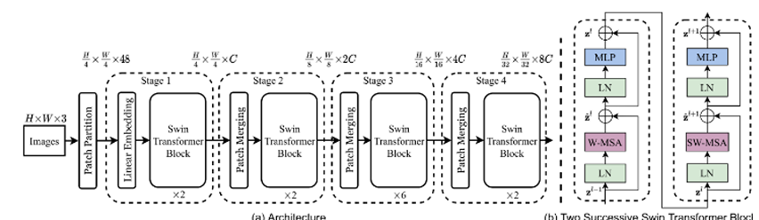
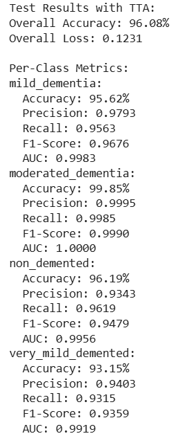
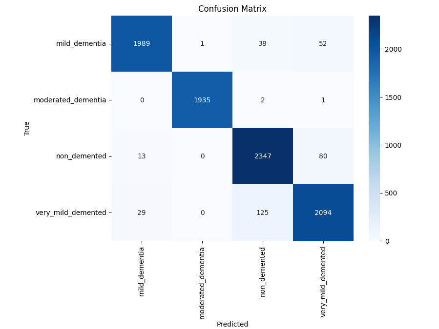
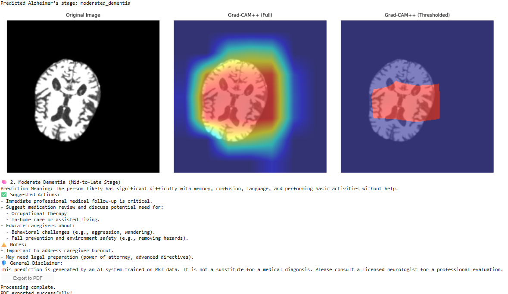

# 🧠 Early Detection of Alzheimer’s Disease Using Swin Transformer with Efficient Multi-Head Attention (EMHA)

**Author:** Mahmoud M. Shoieb  
**Institution:** The British University in Egypt  
**Project Type:** Graduation Project (BSc in Artificial Intelligence)  

---

## 🧩 Project Overview

This project presents a **novel deep learning approach for early-stage Alzheimer’s Disease (AD) detection** using MRI data.  
It integrates the **Swin Transformer architecture** with a custom **Efficient Multi-Head Attention (EMHA)** mechanism to enhance both **accuracy** and **computational efficiency**.

Traditional models often struggle with the **trade-off between model depth, interpretability, and computational cost**.  
To overcome this, the proposed architecture replaces the conventional Multi-Head Self-Attention (MHSA) in Swin Transformer with EMHA — a memory-efficient and computationally optimized variant designed to improve feature extraction in MRI images.

The result was a **state-of-the-art performance** in Alzheimer’s classification across four severity stages.

---

## 📚 Table of Contents
- [Project Overview](#project-overview)
- [Architecture](#architecture)
- [Dataset](#dataset)
- [Tech Stack](#tech-stack)
- [Repository Structure](#repository-structure)
- [Setup / Installation](#setup--installation)
- [How to Run](#how-to-run)
- [Results Summary](#results-summary)
- [Interpretation & Demo](#interpretation--demo)
- [My Contributions](#my-contributions)
- [Acknowledgements](#acknowledgements)
- [License](#license)
- [Contact](#contact)

---

## 🧠 Architecture

### 🏗️ Swin Transformer + EMHA
The architecture is based on the **pretrained Swin-B Transformer** from Microsoft Research.  
The **WindowAttention** module was replaced with a **custom Attention class** that integrates:

- **Efficient Multi-Head Attention (EMHA):**  
  Reduces quadratic complexity of self-attention, improving speed and memory usage.  

- **Continuous Relative Position Bias (CRPB):**  
  Allows the network to capture relative positional information continuously, improving spatial understanding.  

- **Routed / Shared Attention Heads:**  
  Heads can share learned routing patterns, improving generalization and reducing redundancy.

This combination resulted in improved convergence and interpretability while maintaining strong representational power.

---

## 🧬 Dataset

The dataset used was sourced from **ADNI (Alzheimer’s Disease Neuroimaging Initiative)**.  
Due to ADNI’s license restrictions and size constraints, the dataset is **not included** in this repository.  

To access it:
1. Register on [ADNI website](https://adni.loni.usc.edu/).  
2. Request dataset access under research use.  

After approval, you can preprocess MRI images as follows:
- Resize and normalize MRI slices  
- Apply ImageNet normalization  
- Store preprocessed tensors in chunked `.pt` files for training  

---

## ⚙️ Tech Stack

**Language:** Python 3.10+  
**Frameworks & Libraries:**
- `PyTorch` – deep learning framework  
- `torchvision` – pretrained model weights  
- `numpy`, `pandas` – data handling  
- `matplotlib`, `seaborn` – data visualization  
- `tqdm` – training progress bars  
- `scikit-learn` – evaluation metrics  
- `grad-cam` – model interpretation  
- `Google Colab` – training environment with GPU acceleration  

---

## 📁 Repository Structure

```
Alzheimer-Detection-Swin-EMHA/
├─ notebook/
│  └─ Mahmoud-Swin_Transformer_with_EMHA.ipynb
├─ report/
│  └─ Mahmoud_Report_IEEE.pdf
├─ images/
│  ├─ architecture_diagram.png
│  ├─ training_progress.png
│  ├─ confusion_matrix.png
│  └─ gradcam_output.png
└─ README.md
```

---

## 💻 Setup / Installation

1. **Clone the repository**

   ```bash
   git clone https://github.com/<your-username>/Alzheimer-Detection-Swin-EMHA.git
   cd Alzheimer-Detection-Swin-EMHA
   ```

2. **Create a virtual environment**

   ```bash
   python -m venv venv
   venv\Scripts\activate  # Windows
   # or
   source venv/bin/activate  # macOS/Linux
   ```

3. **Install dependencies**

   ```bash
   pip install -r requirements.txt
   ```

   If `requirements.txt` is missing, you can manually install:

   ```bash
   pip install torch torchvision numpy pandas matplotlib seaborn tqdm scikit-learn grad-cam
   ```

---

## 🚀 How to Run

Since the dataset cannot be hosted publicly, users with ADNI access can reproduce results by following these steps:

1. Mount Google Drive in your Colab notebook.
2. Modify dataset paths in the notebook to point to your local or Drive directory.
3. Run the following notebook in Google Colab:

   ```
   notebooks/Mahmoud-Swin_Transformer_with_EMHA.ipynb
   ```

The notebook will:

- Load and preprocess MRI tensors
- Train the modified Swin Transformer model
- Evaluate model accuracy, precision, recall, and F1-score
- Generate Grad-CAM visualizations for interpretability

---

## 📈 Results Summary

| **Metric**           | **Description**                                          | **Result**                |
|----------------------|----------------------------------------------------------|---------------------------|
| **Accuracy**         | Model achieved highest accuracy among all baselines      | ⭐ State-of-the-art        |
| **F1-score**         | Balanced precision and recall                            | Excellent                 |
| **Computation Time** | Reduced training time due to EMHA                        | ⏱️ Significantly Improved |
| **Interpretability** | Grad-CAM visualizations highlight affected brain regions | 🧩 Enhanced Transparency  |

---

## 🖼️ Interpretation & Demo

### Model Architecture

  
*Custom Swin Transformer block with EMHA replacing MHSA.*

### Training Progress

  
*validation accuracy.*

### Confusion Matrix

  
*Visualizing classification performance across 4 Alzheimer’s severity stages.*

### Grad-CAM Visualization

  
*Highlighted brain regions showing areas most influential in model predictions.*


---

## 🧑‍💻 My Contributions

This was a **solo graduation project**, designed, implemented, and documented entirely by **Mahmoud M. Shoieb**.

**My key contributions include:**

- Designing and implementing **Efficient Multi-Head Attention (EMHA)** within the Swin Transformer architecture
- Integrating pretrained **Swin-B** backbone and fine-tuning for 4-class Alzheimer’s classification
- Implementing **k-fold cross-validation**, **adaptive learning rate**, **early stopping**, and **checkpointing**
- Developing a **Grad-CAM-based interpretability pipeline** to visualize affected brain regions
- Building an interactive **Graphical User Interface (GUI)** for user inference
- Writing a detailed **IEEE-style research report** summarizing methodology, results, and insights

---

## 🙌 Acknowledgements

This work was supervised and supported by faculty members at the **British University in Egypt (BUE)**.  
Special thanks to the **ADNI initiative** for providing the MRI dataset used in this research.

---

## 📜 License

This repository is available under the MIT License. See the [LICENSE](LICENSE) file for details.
If you want to use it please cite me.

---

## 📬 Contact

**Mahmoud Shoieb**  
📧 Email: [mahmoudshoieb12@gmail.com](mailto:mahmoudshoieb12@gmail.com)  
💼 GitHub: [https://github.com/Mahmoudshoiebb](https://github.com/Mahmoudshoiebb)  
🔗 LinkedIn: [https://www.linkedin.com/in/mahmoud-shoieb-27959a241/](https://www.linkedin.com/in/mahmoud-shoieb-27959a241/)

---

> “Integrating efficient attention into vision transformers is not just an optimization — it’s a step toward interpretable and accessible AI in healthcare.”
```
